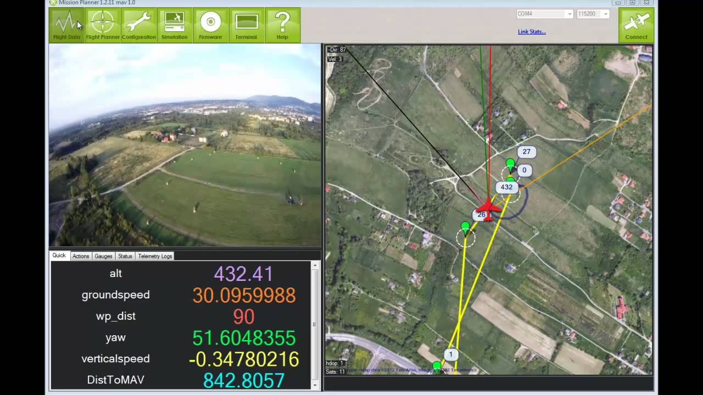

#Ground Control Station

Ground Control Stations (GCS) is a control center that provides the facilities for human control of unmanned vehicles in the air or in space.

The use of this programs is necessary if you don't to use remote controls to control your drone. Is also suplementary to the use of RC, because you can control and monitorize the drone easily.

Thanks to this stations, the user can make lots of actions, such us:

* Setup, configure, and tune your vehicle for optimum performance.
* Plan, save and load autonomous missions into you autopilot with simple point-and-click way-point entry on Google or other maps.
* Download and analyze mission logs created by your autopilot.
* Interface with a PC flight simulator to create a full hardware-in-the-loop UAV simulator.
* With appropriate telemetry hardware you can:
	 * Monitor your vehicle’s status while in operation.
     * Record telemetry logs which contain much more information the the on-board autopilot logs.
     * View and analyze the telemetry logs.
     * Operate your vehicle in FPV (first person view)

Nowadays, this control stations could be used in different platforms: computers, smartphones and tablets.

In this section, we will explain the basics of the next GCSs:

* [APM Planner 2.0](apmplanner.html)
* DroidPlanner (Comming soon)