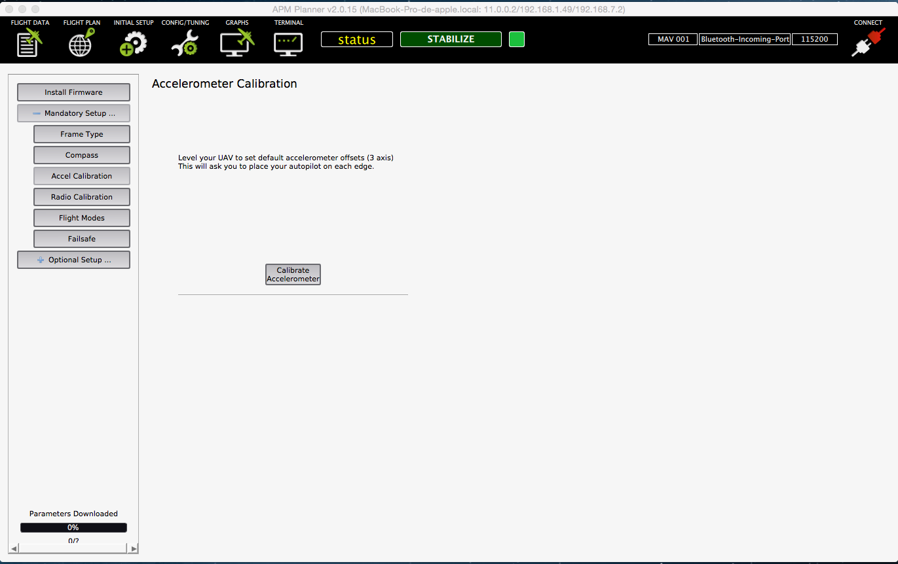
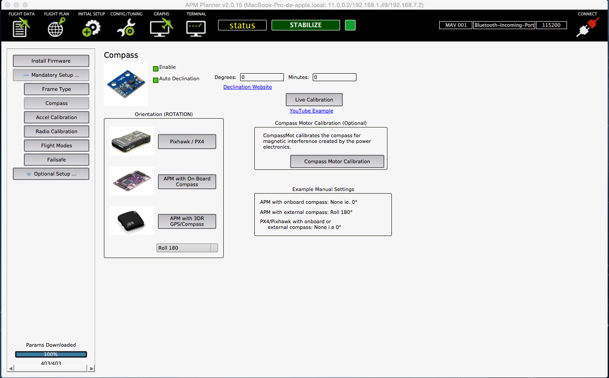
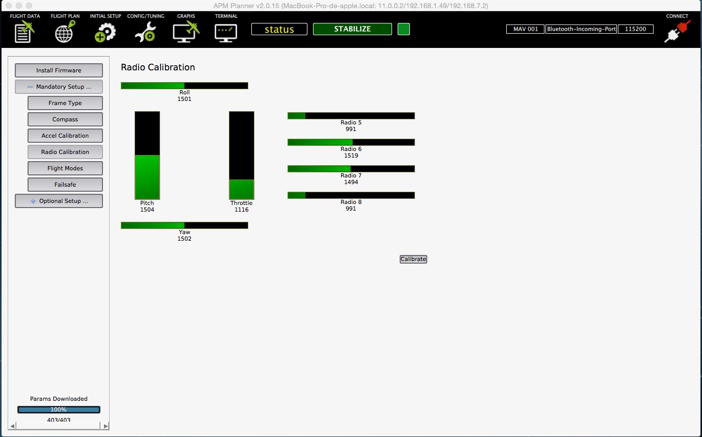
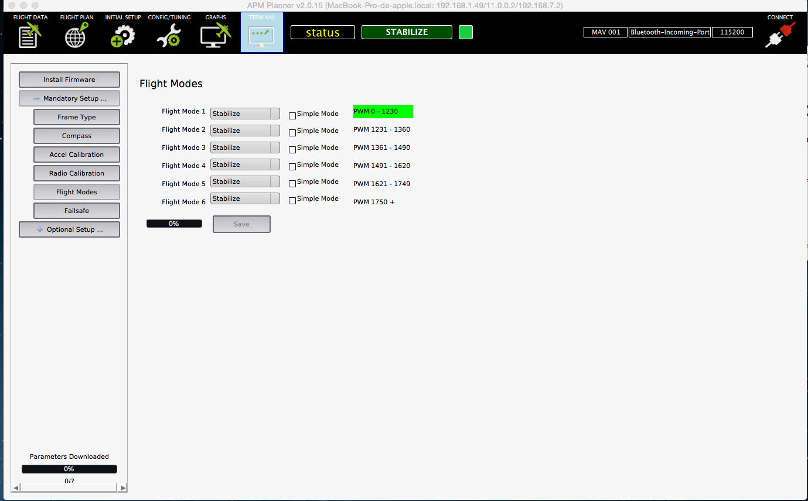

# APM Planner

[APM Planner](http://planner2.ardupilot.com/) 2.0 is an open-source ground station application for MAVlink based autopilots including [Erle-Robotics](http://erlerobotics.com) products that can be run on Windows, Mac OSX, and Linux.

###Installation

You can download APM Planner in the next links:

* [Linux](http://planner2.ardupilot.com/wiki/installation-for-linux/)
* [Windows](http://planner2.ardupilot.com/wiki/install-windows/)
* [Mac](http://planner2.ardupilot.com/wiki/mac-install/)

###Connecting to Erle-Brain/Vehicles

Once you have installed the APM planner in your computer, the next step is to make connection between you computer and [Erle-Brain](http://erlerobotics.com/blog/erle-brain).

When you power up [Erle-Brain](http://erlerobotics.com/blog/erle-brain) or a vehicle/drone that contains this product, it automatically generates a WiFi spot and sets a telemetry port (11.0.0.2:6000) in order to exchange data with the GCS.

Follow the next steps to connect:

* Connect to WiFi, normally called **erle-copter** or **erle-brain**. The password is **holaerle**.
* Open APM Planner.
* Open **Communication** tab, and click on **Add Link -> UDP**
* Clik on **Add IP** and set it to **11.0.0.2:6000**, as in the next image:

* Click on **Connect**
* Restart APM

Now the connection should be established automatically. If is not clear enough, you can watch [this video](https://www.youtube.com/watch?feature=player_detailpage&v=pKJyeTF_Qbo#t=69)!

###APM Planner basics

#####Flight Data Display

Thanks to the **primary flight display**, user can see the orientation of the drone and its inclination.

**Info View** subpanel contains a lot of useful information. In the first tab, you can see some basic parameters of your flight: the altitude, pitch, roll and yaw in degrees, ...

In the **Action** tab, you can arm the drone, select the flight mode, send the the drone to a waypoints,...

In the **Messages* subtab you can read the messages sent using MAVlink. This messages are useful in order to know in which state is the autpilot.

######Initial Setup

This tab is used to calibrate the attached hardware to [Erle-Brain](http://erlerobotics.com/blog/erle-brain).

As it can be see in the image above, you could calibrate compass, accelerometers, radio control, set the flight modes in your rc and configurate the throttle and battery failsafe.

######External Compass

If you use an external compass, as the one that [our GPS](https://erlerobotics.com/blog/product/erle-gps-erle-ublox-gps-compass-kit/) has, you can attach its DF13 4 pin conector to one of the I2C bus conectors, as it is said [here](../hardware/setup/README.md#).

Once you have connected the external compass, proceed to calibrate the device. In order to do so, click on **Compass** button and select **APM with 3DR GPS/Compass** option. In the box below, select **Roll 180**. Once you have done, it should look like:

######IMU calibration

In order to calibrate the three IMUs that [Erle-Brain](http://erlerobotics.com/blog/erle-brain) contains, you should click on **Accel Calibration** option. Once there, click on **Calibrate Accelerometer** box and follow the steps.

You can check [this](https://vimeo.com/56224615) tutorial to know how to do it.
*Note: the APM is older, but the proccess is the same*

######Radio Calibration

The radio calibration consists on taking the maximum and minimum values of each radio channel. In addition, thanks to the calibration of the _auxiliary_ channels, flight modes, failsafe, ... can be configured.

Click on **Radio Calibration** menu, if you have your RC on, you sould see something like:

If you have acquired a new radio or you have included new auxiliary channels (ch 5-8), radio calibration is recommended. 

*Note: Sometimes, even with the RC turned on, some of the channles are set to 0. To fix this, enter in _Config/Tuning_ panel, _Full parameter list_ menu nad click in the _Refresh_ button*

To start the calibration proccess, press *calibrate* button and move all the sticks, swithces and potentiometers to its minimum and maximum value.

You can check [this](https://www.youtube.com/watch?v=iUahfiWcSfY) video to know how to do it.

######Flight Modes

Thanks to this menu, you can configure one of the RC switch and assign them a flight mode. In order to use it, you need to assign a switch of your RC to the channel 5. Typically, it is done with the RCs mixer/auxiliar channel setting.

Once you have done this, simply move the switch of position and check which PWM ranges is taking. Assign this PWM ranges to the flight modes you want to have.

Note that the menu enables to configure six flight modes, but, normally, the RCs only have 2/3 position switch, which makes impossible to use all the flight modes. You could try to make an logic operation between two switches in your RC in order to achieve a six level logical mix.

