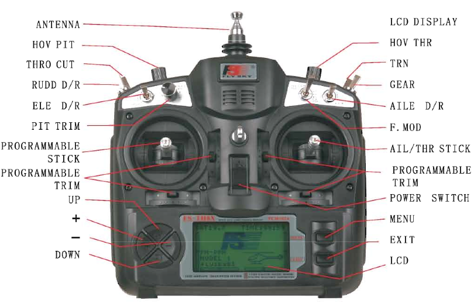

#Radio Control

Radio Control has been widely use by hobbyists to control vehicles. Nowadays, even using highly complex autopilot in drones and a lot of different hardware, the use of RC is still a must, for security reasons.

You can make autonomous flights but is a lot of fun to control yourself the drone! Apart from controlling the drone, a RC enables to do more thins, like:

* Selecting drone flight modes.
* Moving camera gimbal to a desired position.
* Triggering different hardware, like an [EPM](https://www.youtube.com/watch?feature=player_embedded&v=_iyTo9H7HAk)

Right now, in our store we have available FS-TH9X RCs. 

This are some specifications of the RC:

* Channels: 8
*Model type: glider/heli/airlane
* RF range: 2.40-2.48GHz
* Bandwidth: 500KHz
* Band: 160
* RF power: less than 20 dBm
* 2.4G system: AFHDS
* Code type: GFSK
* Sensitivity: 1024
* Low voltage warning: yes(less than 9V)
* DSC port: yes(3.5mm; output: PPM)
* Charger port: yes
* Power: 12V DC(1.5AA*8)
* Weight: 690g

This are the different control/switches installed in the RC:

###Setting GEAR switch for flight modes

GEAR switch can be easily configurated to have *two* flight modes in the RC. If you would like to change to modes not included in your RC, use a GCS.

[Here](https://www.youtube.com/watch?v=mL3DkoXRT_I&feature=youtu.be) you can find a tutorial about how to configure the TH9x GEAR switch and the drone properly, in order to have this two modes mentioned above.

### Setting 3-way switch for flight modes

Check [this video](https://www.youtube.com/watch?v=6n_5wNA2jTI) to make a 3-way switch the flight mode selector. Notice that you will need and 8 channel output receiver and a 8 to 1 channel PPM sum.

### Setting Simple flight mode

Check [this](http://erlerobotics.gitbooks.io/erle-robotics-erle-brain-a-linux-brain-for-drones/content/en/GCS/apmplanner.html#configuring-simple-mode) page in order to configure the RC and the drone to use this mode.
