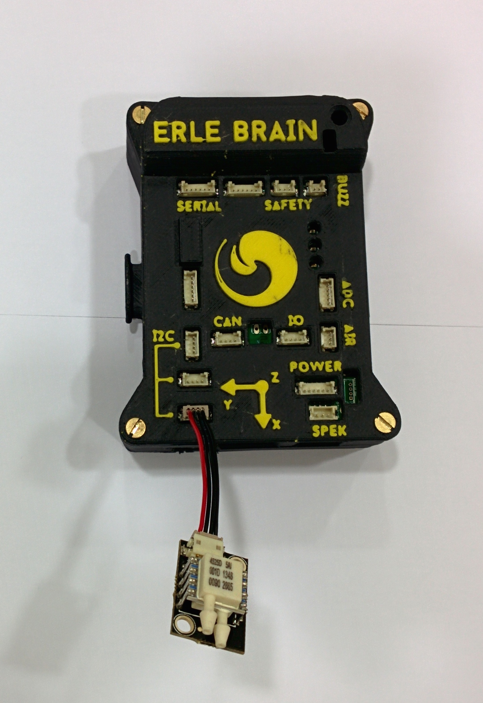

# Air Speed sensor

An air speed sensor can help in windy condition, slow flight and autonomous landings. It is not recommended for most new users, however, as it does require additional tuning and adds one more layer of control to set up.

[Erle-Brain](http://erlerobotics.com/blog/product/erle-brain/) interfaces with several airspeed sensors, read more about the air speed sensor [here](http://plane.ardupilot.com/wiki/common-optional-hardware/airspeed-3/).