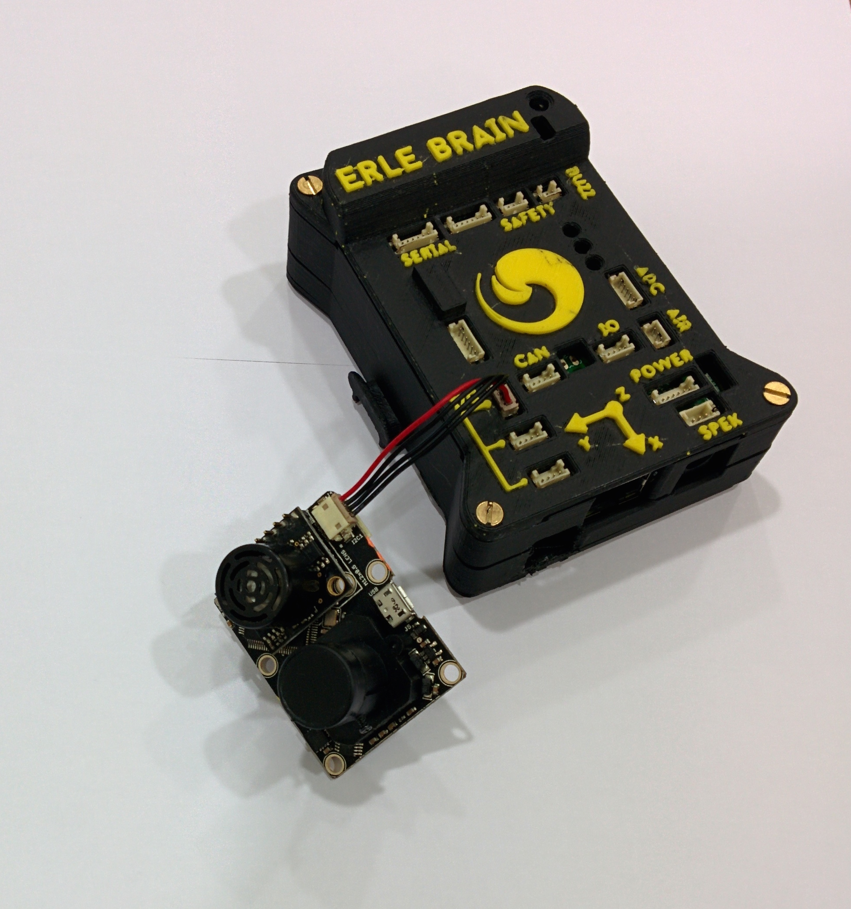

# Optical Flow sensor

[Erle-Brain](http://erlerobotics.com/blog/product/erle-brain/) also interfaces with optical flow sensors such as the [PX4-FLOW](https://pixhawk.org/modules/px4flow). A specialized high resolution downward pointing camera module that uses the ground texture and visible features plus the built-in Maxbotix LZ-EZ4 sonar to determine aircraft ground velocity.  

Read more about it [here](http://copter.ardupilot.com/wiki/common-optional-hardware/common-optical-flow-sensors-landingpage/common-px4flow-overview/).