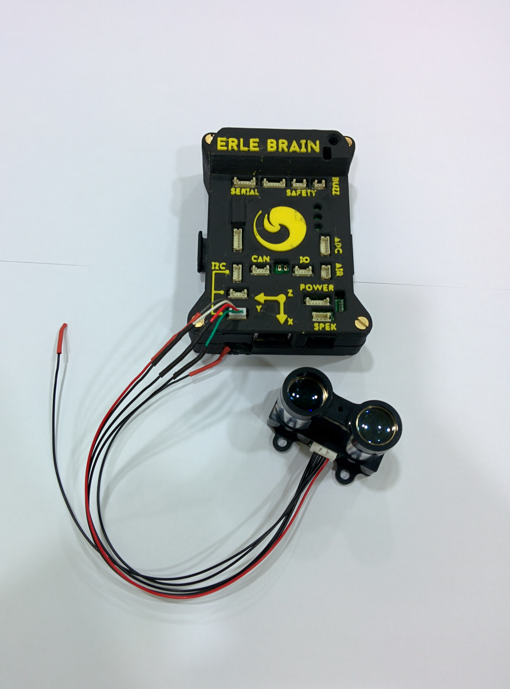

# Range Finder sensor

A LIDAR is a remote sensing technology that measures distance by illuminating a target with a laser and analyzing the reflected light.  

[Erle-Brain](http://erlerobotics.com/blog/product/erle-brain/) interfaces with the [PulsedLight LIDAR-Lite](http://pulsedlight3d.com/) rangefinder is a low-cost optical distance measurement solution with up to a 60m range, low power consumption, and small form factor.