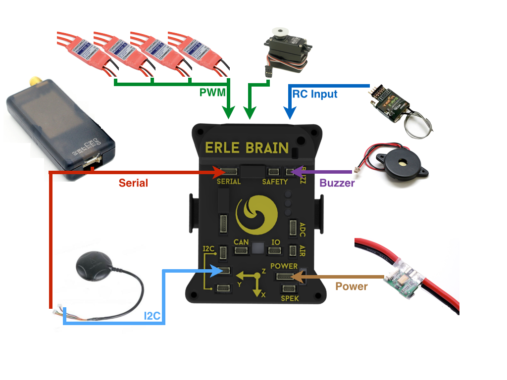
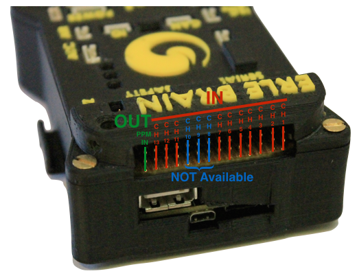
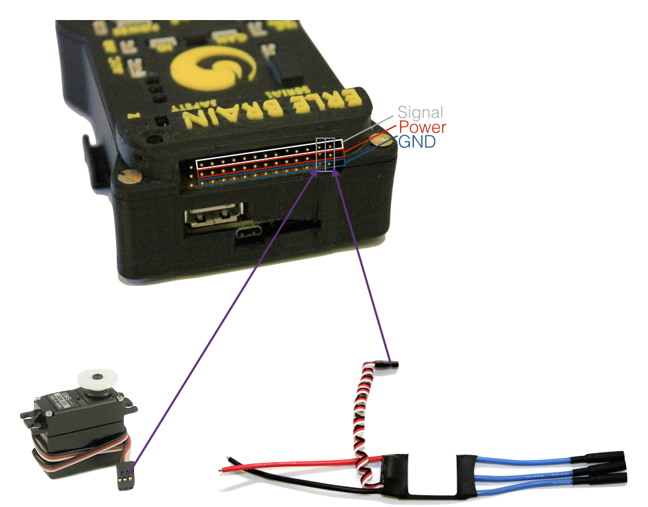
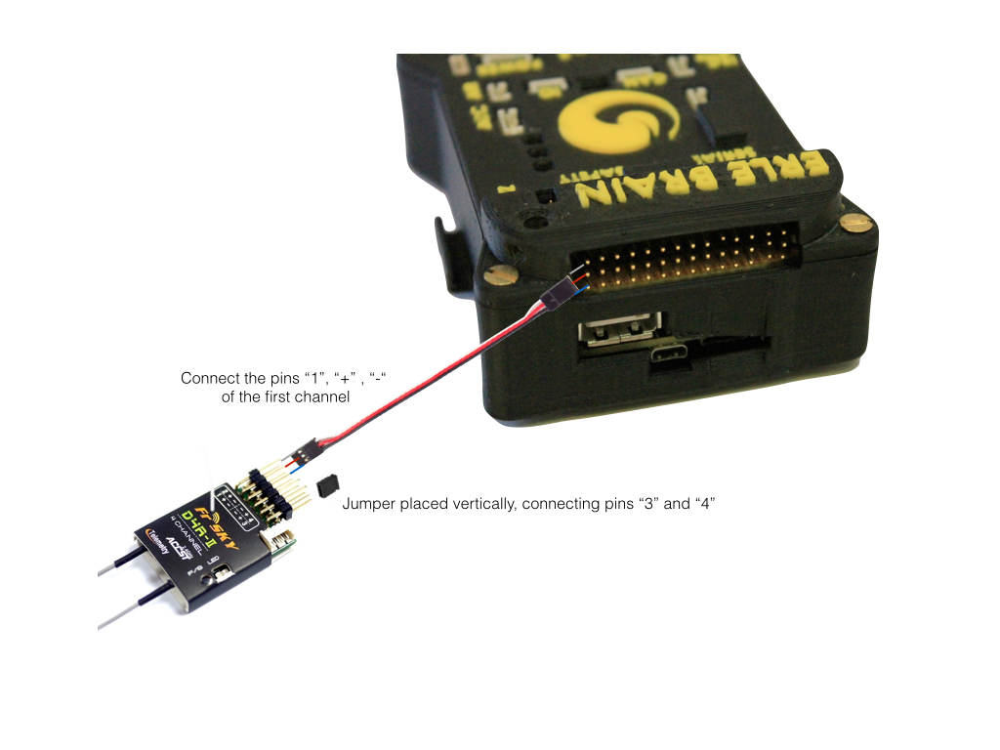
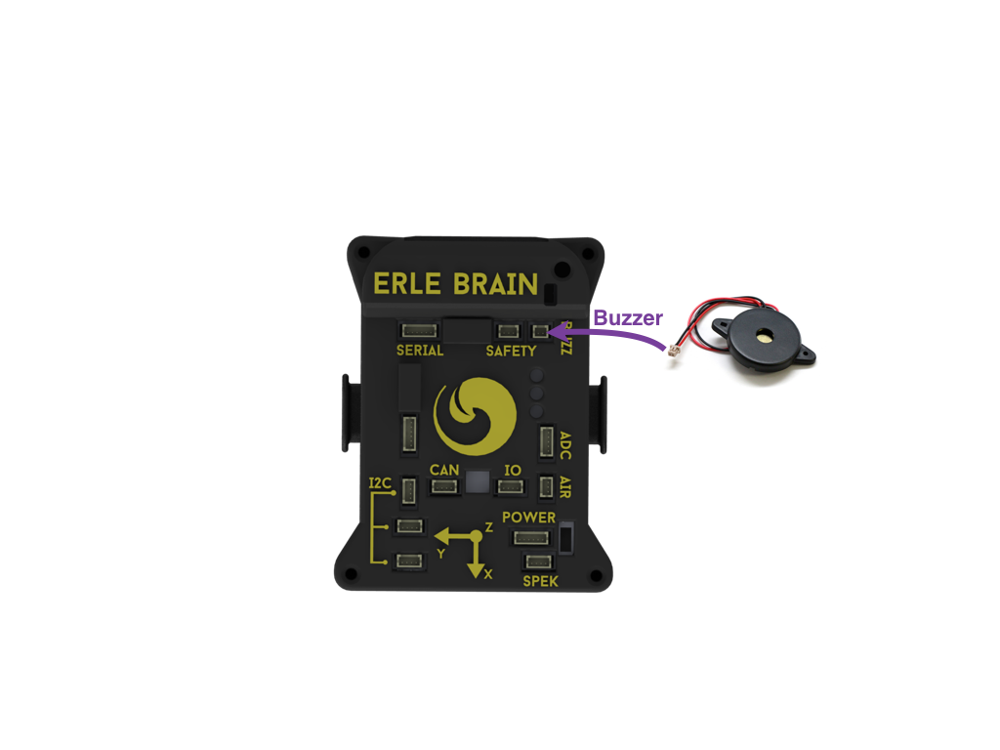
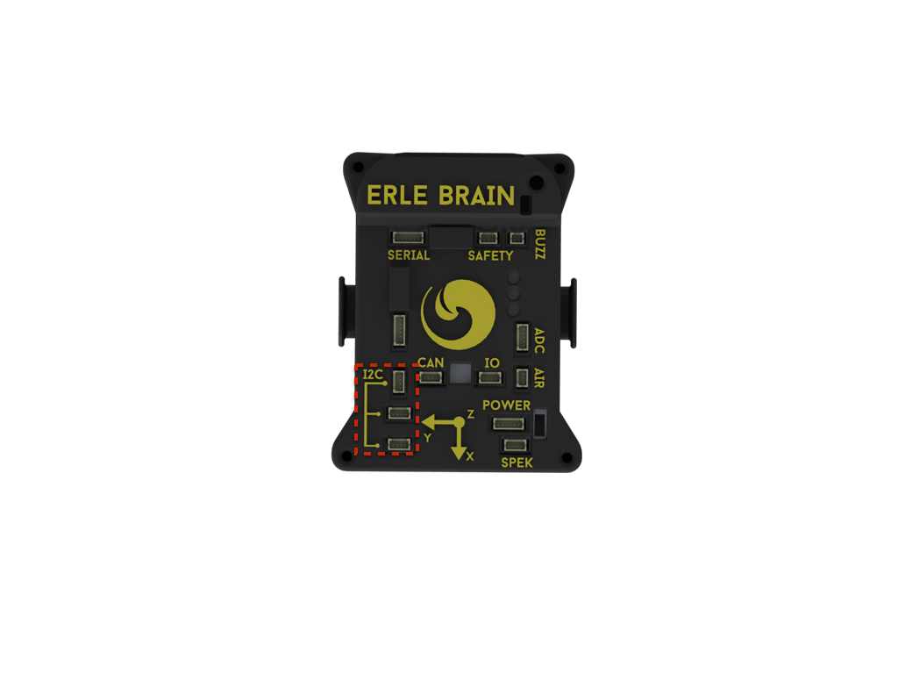
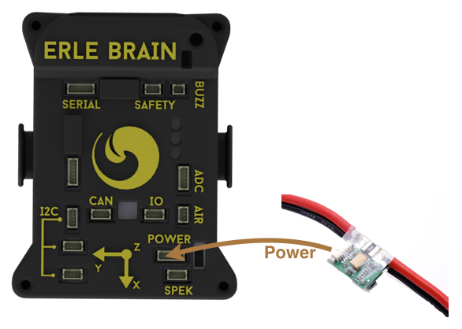
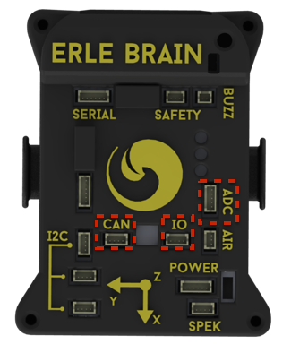

#Hardware Setup

In this section we are going to show in which connector you should attach each additional device. 

*Note*: be cautios when disconnecting devices from DF13 connectors, the first times connectors could be stiff.

The image below, shows the most common hardware attached to Erle-Brain:

##Typical Hardware Setup

##PWM out
The Erle-Brain has 10 channel of PWM output. In this channels, the most typical devices that you could connect are: ESCs, servos, gimbal servos,...

The next image show which are the PWM channels:

The top row provides the PWM signal, the center 5v and the bottom is the GND signal. Make sure you plug the device connector in the right way.

##RC Input
The radio control receiver must be connected in the channel 14 rail, as shown below:

##Buzzer
The buzzer must be connected into single two pins DF13 connector of ther Erle-Brain.

##GPS + Compass
As default, the GPS must be connected to the port *Serial*. This port will power up the device.
The *I2C* bus is used to connect the compass to Erle-Brain.

##I2C bus
The Erle-Brain contains three *I2C* bus connectors, which gives access to the *I2C1* bus. In this bus you could connect lots of different sensor and devices, i.e.: compass, gas sensors, temperature sensors, ...

##Power
Use this connector to feed Erle-Brain from the Power-Module.

##Other buses/ports

####I/O
This connector allows to connect external hardware to two GPIOs. It also supplies with 3v3.

####CAN
Use this connector to access Erle-Brain CAN bus.

------------------------------------------------
*Note*: One good example of use of *GPIO* and *CAN* connectors are the [ubleds](https://www.youtube.com/watch?v=GHeZ_jrA8lg).

------------------------------------------------

####ADC
Erle-Brain also has a dedicated ADC bus, that contains two ADC channels. The connector also supplies 5 volts. 

--------
*Warning*: The range of input of the ADCs are 0~1.8v. Do not connect any voltage that exceeds this voltage.

--------
