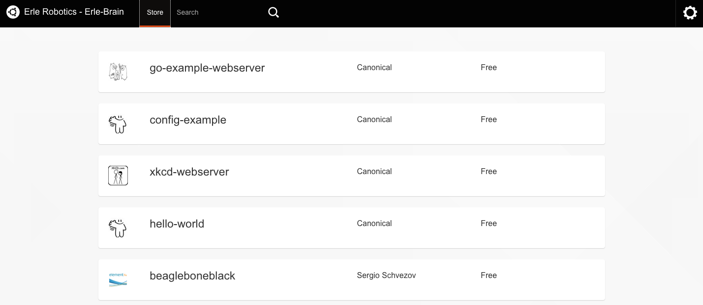
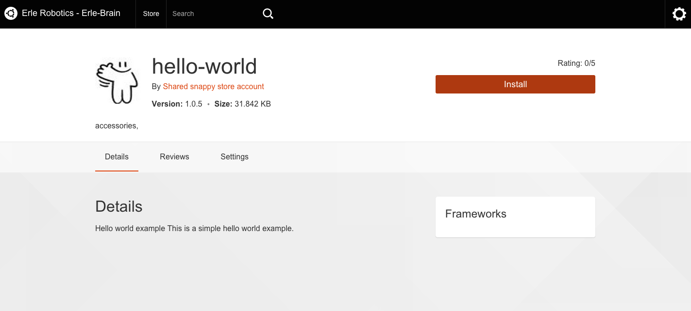
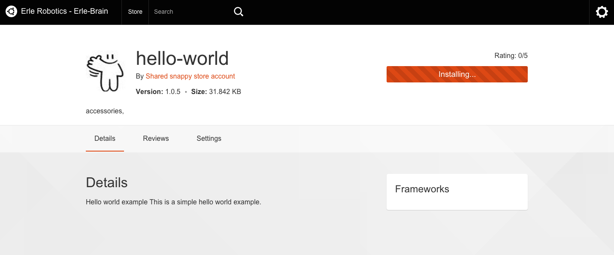
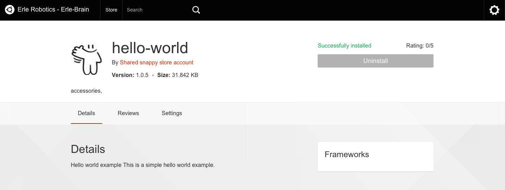

# Installing an app (snap)

Installing apps (aka **snaps**) with Snappy is super easy, just put any of the IP addresses of the device in your browser and port `4200` (e.g.: `http://192.168.7.2:4200`):



Now just select one of the available apps in the store:



Clicking `install` the installation process will begin:



Once the process has finished, you'll get a screen like the following:



All done! Now you have `hello world` app installed and run the app with `echo.hello-world.canonical`, obtaining:

```bash
Hello World!
```
