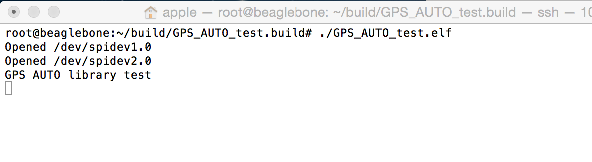

#ArduPilot Examples

###The Example Sketches

The first step in exploring the code for yourself is to use the example sketches for the libraries. Following the arduino tradition we have example sketches for most libraries. A ‘sketch’ is just a main program, written as a pde file. By using a pde file the build rules and dependencies are automatically generated from the #include lines in the file, which simplifies making new sketches.

Knowing the library API and conventions used in ArduPilot is essential to understanding the code. So using the library example sketches is a great way to get started. As a start you should read, build and run the example sketches for the following libraries:

    libraries/AP_GPS/examples/GPS_AUTO_test
    libraries/AP_InertialSensor/examples/INS_generic
    libraries/AP_Compass/examples/AP_Compass_test
    libraries/AP_Baro/examples/BARO_generic
    libraries/AP_AHRS/examples/AHRS_Test

For example, the following will build and install the AP_GPS example sketch on Erle-Brain:

cd libraries/AP_GPS/examples/GPS_AUTO_test
make clean
make px4

*Note* : Notice that if you try to compile large amount of code, the compilation time could be longer than desired. You could compile the code in your computer with a cross-compiler and copy the executable to Erle-Brain.

Once you have compiled the code, place to the folder where the executable has been deposited:
`~/build/GPS_AUTO_test.build`

And execute the example: `./GPS_AUTO_test.elf `

You should see something like:

###Understanding the example sketch code

When you are reading the example sketch code (such as the [GPS_AUTO_test](https://github.com/erlerobot/ardupilot/blob/master/libraries/AP_GPS/examples/GPS_AUTO_test/GPS_AUTO_test.pde) code) you will notice a few things that may seem strange at first:

    the pde file has a lot of includes
    it declares a ‘hal’ variable as a reference
    the code is quite rough and not well commented
    the setup() and loop() functions

#####The sketch includes

The large number of include lines comes from the way that a pde file uses include lines as a “implied build system”. When building the code there is a [little snippet of awk code](https://github.com/erlerobot/ardupilot/blob/master/mk/sketch_sources.mk) that is used to turn the pde into a C++ file. That awk code also uses the include lines to work out what include directories are needed (ie. -I options in the compiler command line) and what libraries need to be linked to. So the pde needs to include the headers for all libraries that are needed for this sketch, and due to nested dependencies this turns out to be rather a lot of include lines.

It is not uncommon to find that an example sketch doesn’t build, usually due to missing include lines for some library that has become a dependency. Just add the include line needed then submit a pull request to fix the main tree. Thanks!

#####The hal reference

Every file that uses features of the AP_HAL needs to declare a hal reference. That gives access to a AP_HAL::HAL object, which provides access to all hardware specific functions, including things like printing messages to the console, sleeping and talking to I2C and SPI buses.

The actual hal variable is buried inside the board specific AP_HAL_XXX libraries. The reference in each file just provides a convenient way to get at the hal.

The most commonly used hal functions are:

    hal.console->printf() and hal.console->printf_P() to print strings (use the _P to use less memory on AVR)
    hal.scheduler->millis() and hal.scheduler->micros() to get the time since boot
    hal.scheduler->delay() and hal.scheduler->delay_microseconds() to sleep for a short time
    hal.gpio->pinMode(), hal.gpio->read() and hal.gpio->write() for accessing GPIO pins
    I2C access via hal.i2c
    SPI access via hal.spi

Go and have a look in the libraries/AP_HAL directory now for the full list of functions available on the hal.

#####The setup() and loop() functions

You will notice that every sketch has a setup() function and loop() function. The setup() function is called when the board boots. The actual call comes from within the HAL for each board, so the main() function is buried inside the HAL, which then calls setup() after board specific startup is complete.

The setup() function is only called once, and typically initialises the libraries, and maybe prints a “hello” banner to show it is starting.

After setup() is finished the loop() function is continuously called (by the main code in the AP_HAL). The main work of the sketch is typically in the loop() function.

Note that this setup()/loop() arrangement is only the tip of the iceberg for more complex boards. It may make it seem that ArduPilot is single threaded, but in fact there is a lot more going on underneath, and on boards that have threading (such as the Erle-Brain) there will in fact be lots of realtime threads started. See the section on understanding ArduPilot threading below.

#####The AP_HAL_MAIN() macro

You will notice a extra line like this at the bottom of every sketch:

AP_HAL_MAIN();

That is a HAL macro that produces the necessary code to declare a C++ main function, along with any board level initialization code for the HAL. You rarely have to worry about how it works, but if you are curious you can look for the #define in the AP_HAL_XXX directories in each HAL. It is usually in AP_HAL_XXX_Main.h.
