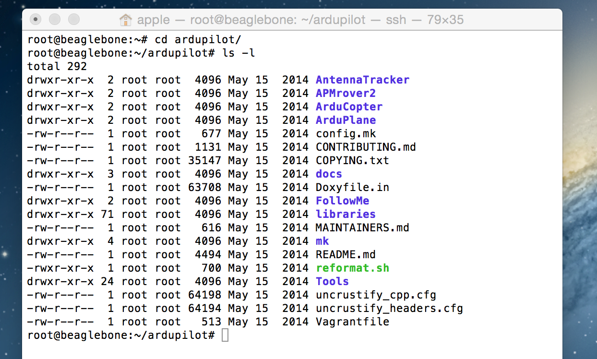
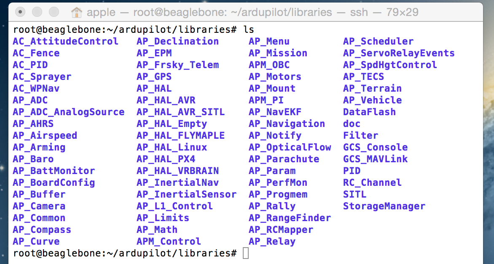

#Learning ArduPilot – Introduction

This page introduces the basic structure of ArduPilot.

###Basic Structure

The basic structure of ArduPilot is broken up into 5 main parts:

    vehicle directories
    AP_HAL
    libraries
    tools directories
    external support code

###Vehicle Directories

The vehicle directories are the top level directories that define the firmware for each vehicle type. Currently there are 4 vehicle types – ArduPlane, ArduCopter, APMrover2 and AntennaTracker. The vehicle directories contain .pde files, which are pre-processed into cpp files at build time. This is a hangover from the original arduino “sketch” approach which came from the “processing” system. Keeping the .pde files allows us to still build for AVR targets with the old arduino IDE, although we may drop it in the future.

Let's see how ArduPilot is organized within Erle-Brain. In order to do so, first you need to connect via `ssh`. Follow the next steps:

* Turn on Erle-Brain
* Connect to its WiFi`
* Open a terminal session and type:  `ssh root@11.0.0.1`
* Move to ArduPilot folder: `cd ardupilot`
* List the content: `ls -l`

###AP_HAL

The AP_HAL layer (Hardware Abstraction Layer) is how we make ArduPilot portable to lots of different platforms. There is a top level AP_HAL in libraries/AP_HAL that defines the interface that the rest of the code has to specific board features, then there is a AP_HAL_XXX subdirectory for each board type, for example AP_HAL_AVR for AVR based boards, AP_HAL_PX4 for PX4 boards and AP_HAL_Linux for Linux based boards.

The Erle-Brain is a Linux based board, therefore, device portability it is made in this level. 

Let's see how is distributed this `libraries` folder. Assuming you are already connected into Erle-Brain:

* Place into the desired folder: `cd ardupilot/libraries`
* List its content: `ls`

You should see the next folders:

You will notice that there are some extra folders. Don't worry about those ones right now. That folders contains autopilots elements implementation : motors, accelerometers, buzzer, ...

###Tools directories

The tools directories are miscellaneous support directories. For examples, tools/autotest provides the autotest infrastructure behind the autotest.diydrones.com site and tools/Replay provides our log replay utility.

###External support code

On some platforms we need external support code to provide additional features or board support. Currently the external trees are:

    PX4NuttX – the core NuttX RTOS used on PX4 boards
    PX4Firmware – the base PX4 middleware and drivers used on PX4 boards
    uavcan – the uavcan CANBUS implementation used in ArduPilot
    mavlink – the mavlink protocol and code generator

 
###Build system

The build system is based around make, but also supports the old arduino IDE for AVR builds. The makefiles are in the mk/ directory, and define build rules for each type of supported board.

To build a vehicle or other ‘sketch’ for a particular board target you would type “make TARGET”, where TARGET is the board type. In order to build the code for Erle-Brain, you should type:

    make pxf 

For each of these builds you can add additional qualifiers, and on some you can do a parallel build to speed things up. For example, in the ArduCopter directory you could do:

    make pxf -j8

meaning do a build for Erle-Brain with an 8 way parallel build. You should also look into enabling ccache for faster builds.

There are also helper make targets, such as:

    make clean – clean the build
