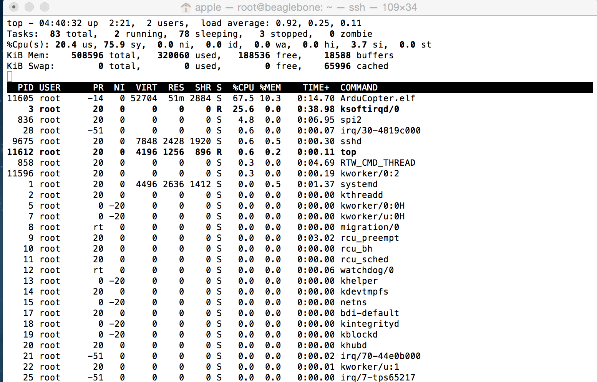

#Ardupilot Threading

###Contents

[Understanding ArduPilot threading](#understanding-ardupilot-threading)
* [The timer callbacks](#the-timer-callbacks)
* [HAL specific threads](#hal-specific-threads)
* [Driver specific threads](#driver-specific-threads)
* [Ardupilot drivers versus platform drivers](#ardupilot-drivers-versus-platform-drivers)
* [Platform specific threads and tasks](#platform-specific-threads-and-tasks)
* [The AP_Scheduler system](#the-ap-scheduler-system)
* [Semaphores](#semaphores)
* [Lockless Data Structures](#lockless-data-structures)

###Understanding ArduPilot threading

Once you have learned the basic of the ArduPilot libraries it is time for you to understand how ArduPilot deals with threading. The setup()/loop() structure that was inherited from arduino may make it seem that ArduPilot is a single threaded system, but in fact it isn’t.

The threading approach in ArduPilot depends on the board it is built for. Some boards (such as the APM1 and APM2) don’t support threads, so make do with a simple timer and callbacks. Erle-Brain support a rich Posix threading model with realtime priorities, and these are used extensively by ArduPilot.

There are a number of key concepts related to threading that you need to understand in ArduPilot:

 - The timer callbacks
 - HAL specific threads
 - driver specific threads
 - ardupilot drivers versus platform drivers
 - platform specific threads and tasks
 - the AP_Scheduler system
 - semaphores
 - lockless data structures

###The timer callbacks

Every platform provides a 1kHz timer in the AP_HAL. Any code in ArduPilot can register a timer function which is then called at 1kHz. All registered timer functions are called sequentially. This very primitive mechanism is used as it is extremely portable, and yet very useful. You register a timer callback by calling the hal.scheduler->register_timer_process() like this:

  hal.scheduler->register_timer_process(AP_HAL_MEMBERPROC(&AP_Baro_MS5611::_update));

that particular example is from the MS5611 barometer driver. The AP_HAL_MEMBERPROC() macro provides a way to encapsulate a C++ member function as a callback argument (bundling up the object context with the function pointer).

When a piece of code wants something to happen at less than 1kHz then it should maintain it’s own “last_called” variable and return immediately if not enough time has passed. You can use the hal.scheduler->millis() and hal.scheduler->micros() functions to get the time since boot in milliseconds and microseconds to support this.

You should now go and modify an existing example sketch (or create a new one) and add a timer callback. Make the timer increment a counter then print the value of the counter every second in the loop() function. Modify your function so that it increments the counter  every 25 milliseconds.

###HAL specific threads

On platforms that support real threads the AP_HAL for that platform will create a number of threads to support basic operations. For example, on Erle-Brain the following HAL specific threads are created:

    The UART thread, for reading and writing UARTs (and USB)
    The timer thread, which supports the 1kHz timer functionality described above
    The IO thread, which supports writing to the microSD card, EEPROM and FRAM

Have a look in Scheduler.cpp inside each AP_HAL implementation to see what threads are created and what the realtime priority of each thread is.

Now check it in the Erle-Brain: type `top` in the ssh session. You should see something like:

Apart from ArduCopter process, you can see other processes like the ssh session, SPI bus transaction, interrupt request handlers, watchdog, ...

Other AP_HAL ports have more or less threads depending on what is needed.

One common use of threads is to provide drivers a way to schedule slow tasks without interrupting the main autopilot flight code. For example, the AP_Terrain library needs to be able to do file IO to the microSD card (to store and retrieve terrain data). The way it does this is it calls the function hal.scheduler->register_io_process() like this:

hal.scheduler->register_io_process(AP_HAL_MEMBERPROC(&AP_Terrain::io_timer));

The sets up the AP_Terrain::io_timer function to be called regularly. That is called within the boards IO thread, meaning it is a low realtime priority and is suitable for storage IO tasks. It is important that slow IO tasks like this not be called on the timer thread as they would cause delays in the more important processing of high speed sensor data.

###Driver specific threads

It is also possible to create driver specific threads, to support asynchronous processing in a manner specific to one driver. Currently you can only create driver specific threads in a manner that is platform dependent, so this is only appropriate if your driver is intended to run only on one type of autopilot board. If you want it to run on multiple AP_HAL targets then you have two choices:

    you can use the register_io_process() and register_timer_process() scheduler calls to use the existing timer or IO threads
    you can add a new HAL interface that provides a generic way to create threads on multiple AP_HAL targets (please contribute patches back)

An example of a driver specific thread is the ToneAlarm thread in the Linux port. See AP_HAL_Linux/ToneAlarmDriver.cpp

###Ardupilot drivers versus platform drivers

You may notice some driver duplication in ArduPilot. For example, we have a MPU6000 driver in libraries/AP_InertalSensor/AP_InertialSensor_MPU6000.cpp, and another MPU6000 driver in PX4Firmware/src/drivers/mpu6000.

The reason for this duplication is that the PX4 project already provides a set of well tested drivers for hardware that comes with PX4 boards, and we enjoy a good collaborative relationship with the PX4 project on developing and enhancing these drivers. So when we build ArduPilot for PX4 we take advantage of the PX4 drivers by writing small “shim” drivers which present the PX4 drivers with the standard ArduPilot library interface. If you look at libraries/AP_InertialSensor/AP_InertialSensor_PX4.cpp you will see a small shim driver that asks the PX4 what IMU drivers are available on this board and automatically makes all of them available as part of the ArduPilot AP_InertialSensor library.

So if we have an MPU6000 on the board we use the AP_InertialSensor_MPU6000.cpp driver on non-PX4 platforms, and the AP_InertialSensor_PX4.cpp driver on PX4 based platforms.

The same type of split can also happen for other AP_HAL ports. For example, we could use Linux kernel drivers for some sensors on Linux boards. For other sensors we use the generic AP_HAL I2C and SPI interfaces to use the ArduPilot “in-tree” drivers which work across a wide range of boards.

###Platform specific threads and tasks

On some platforms there will be a number of base tasks and threads that will be created by the startup process. These are very platform specific so we will focuse on Erle-Brain. The startup of the tasks is controled by the Erle-Brain specific [apm4-startup.sh](http://pastebin.com/95TbBtpW)

As you can observe in the link, this startup script loads all the necessary to make Erle-Brain fly. First it loads all the necessary *capes*: SPI, PRU, RC input, Serial, PWM and ADC.

Secondly, forces the WiFi interface to have the expected 11.0.0.1 IP. Finally, launches the AutoPilot. Depending which vehicle you are using, you will see different executable names: ArduCopter, ArduPlane or APM2rover. It also specifies the telemetry communication protol, IP and port.

If you would like to launch ROS by default, you can add ROS initilization lines here. 

###The AP_Scheduler system

The next aspect of ArduPilot threading and tasks to understand is the AP_Scheduler system. The AP_Scheduler library is used to divide up time within the main vehicle thread, while providing some simple mechanisms to control how much time is used for each operation (called a ‘task’ in AP_Scheduler).

The way it works is that the loop() function for each vehicle implementation contains some code that does this:

    wait for a new IMU sample to arrive
    call a set of tasks between each IMU sample

It is a table driven scheduler, and each vehicle type has a AP_Scheduler::Task table. To learn how it works have a look at the [AP_Scheduler/examples/Scheduler_test.pde sketch](https://github.com/erlerobot/ardupilot/blob/master/libraries/AP_Scheduler/examples/Scheduler_test/Scheduler_test.pde).

If you look inside that file you will see a small table with a set of 3 scheduling tasks. Associated with each task are two numbers. The table looks like this:

static const AP_Scheduler::Task scheduler_tasks[] PROGMEM = {
 { ins_update, 1, 1000 },
 { one_hz_print, 50, 1000 },
 { five_second_call, 250, 1800 },
};

The first number after each function name is the call frequency, in units controlled by the ins.init() call. For this example sketch the ins.init() uses RATE_50HZ, so each scheduling step is 20ms. That means the ins_update() call is made every 20ms, the one_hz_print() function is called every 50 times (ie. once a second) and the five_second_call() is called every 250 times (ie. once every 5 seconds).

The third number is the maximum time that the function is expected to take. This is used to avoid making the call unless there is enough time left in this scheduling run to run the function. When scheduler.run() is called it is passed the amount of time (in microseconds) available for running tasks, and if the worst case time for this task would mean it wouldn’t fit before that time runs out then it won’t be called.

Another point to look at closely is the ins.wait_for_sample() call. That is the “metronome” that drives the scheduling in ArduPilot. It blocks execution of the main vehicle thread until a new IMU sample is available. The time between IMU samples is controlled by the arguments to the ins.init() call.

Note that tasks in AP_Scheduler tables must have the following attributes:

    they should never block (except for the ins.update() call)
    they should never call sleep functions when flying (an autopilot, like a real pilot, should never sleep while flying)
    they should have predictable worst case timing

You should now go and modify the Scheduler_test example and add in your own tasks to run. Try adding tasks that do the following:

    read the barometer
    read the compass
    read the GPS
    update the AHRS and print the roll/pitch

Look at the example sketches for each library that you worked with earlier in this tutorial to understand how to use each sensor library.

###Semaphores

When you have multiple threads (or timer callbacks) you need to ensure that data structures shared by the two logical threads of execution are updated in a way that prevents corruption. There are two principle ways of doing this in ArduPilot – semaphores and lockless data structures.

AP_HAL Semaphores are just wrappers around whatever semaphore system is available on the specific platform, and provide a simple mechanism for mutual exclusion. For example, I2C drivers can ask for the I2C bus semaphore to ensure that only one I2C device is used at a time.

Go and have a look at the hmc5883 driver in libraries/AP_Compass/[AP_Compass_HMC5843.cpp](https://github.com/erlerobot/ardupilot/blob/master/libraries/AP_Compass/AP_Compass_HMC5843.cpp) and look for the _i2c_sem variable. Look at all the places it is used, and see if you can work out why it is needed.

###Lockless Data Structures

The ArduPilot code also contains examples of using lockless data structures to avoid the need for a semaphore. This can be a lot more efficient than semaphores.

Two examples of lockless data structures in ArduPilot are:

* The _shared_data structure in libraries/AP_InertialSensor/[AP_InertialSensor_MPU9250.cpp](https://github.com/erlerobot/ardupilot/blob/master/libraries/AP_InertialSensor/AP_InertialSensor_MPU9250.cpp)

* The ring buffers used in numerous places. A good example is libraries/DataFlash/[DataFlash_File.cpp](https://github.com/erlerobot/ardupilot/blob/master/libraries/DataFlash/DataFlash_File.cpp)

Go and have a look at these two examples, and prove to yourself that they are safe for concurrent access. For DataFlash_File look at the use of the `_writebuf_head` and `_writebuf_tail variables.

It would be nice to create a generic ring buffer class which could be used instead of the separate ringbuffer implementations in several places in ArduPilot. If you want to contribute that then please do a pull request!
