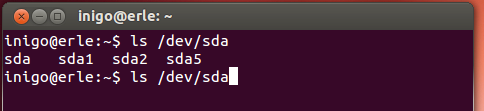
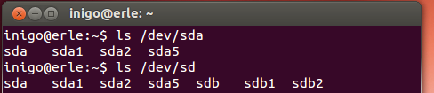

#Upgrading Erle-Brain

In Erle-Robotics, we are constantly upgrading our software: autopilot fix/upgrades, new features,... Is a common practice to reflash the board's eMMC in order to execute the latest software/features. Follow the next steps to upgrade you Erle-Brain to the latest version.

###Download the latest image

First of all, download the latest image to your computer. You can find it [here](chrome://mega/content/secure.html#!vY8GzTTQ!pRdmdNJd1-rqdSDliD8SgKuHRrTFV_NRpxtF7p34Fhw)

###Detect where the SD is mounted

If you are not familiar with Linux, you may don't know how to check where the SD is mounted. One easy way, is to prin, in the command line, which devices you have mounted in your computer. To do so, type this commands:

> ls /dev/sd

When you have typed this, do not type *enter*, type *tab* many times. You will see something like:

Now, you know which memory devices are actually mounter in your computer. Now, plug the SD and type again:

> ls /dev/sd

You will see that a new device is shown:

In this case `sdb`, `sdb1` and `sdb2` has shown. The las two are partitions within `sdb`, so the SD is mounted in `/dev/sdb`.That's how could be known where is mounter the SD card. 

### Flash the SD with the image

Once you have this info, procceed to flash the image. First you have to place yourself in the folder where the image is, using `cd ` command. Asumming that the image is called `erlerobot-ubuntu.img.gz`, and that the SD card is mounted under `/dev/sdb` , type on your terminal:

> zcat erlerobot-ubuntu.img.gz | sudo dd of=/dev/sdb bs=8M

To ensure that the image has been copied correctly, type

> sync
