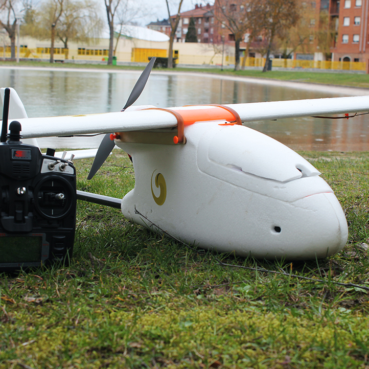

# Vehicles

The Erle-Brain can be integrated in different vehicles thanks to its modularity. The PixHawk Fire cape has been design to support APM (ardupilot) project thereby it can be used in different vehicles and configurations.

This are the vehicles that we offer:

- Erle-Copter:

- Erle-Plane:

- Erle-Rover:

=======
- Erle-Rover:

>>>>>>> vehiclesbranch

- Erle-Copter:

- Erle-Plane:

This vehicles are available from the [Erle Robotics store](http://erlerobotics.com/blog/product-category/vehicles/)

This specific solutions are not the only ones, in the future, we are sure that new vehicles will be released.
