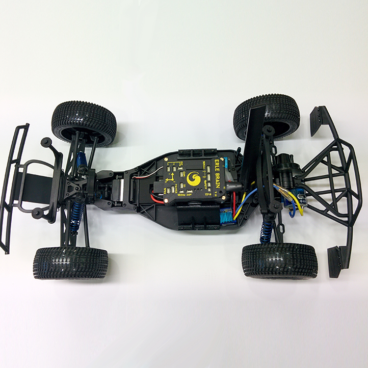
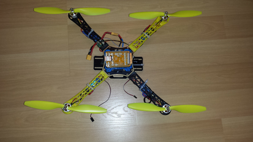

# Vehicles

The PXF has been design to support APM (ardupilot) project thereby it can be used in different vehicles and configurations:

PixHawk Fire Cape being used in a copter

PixHawk Fire Cape being used in a rover

PixHawk Fire Cape being used in a plane
