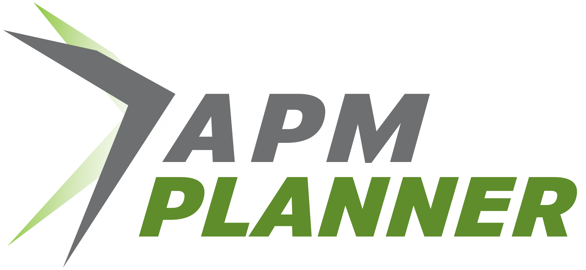
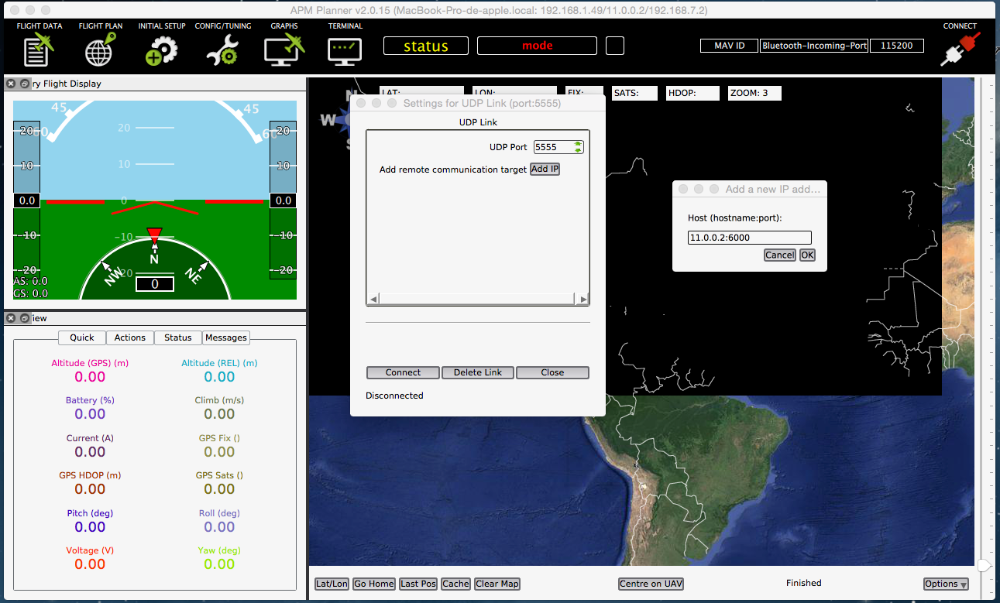
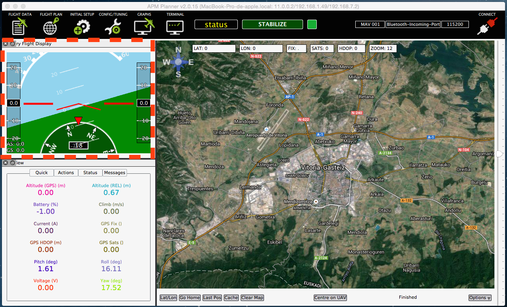
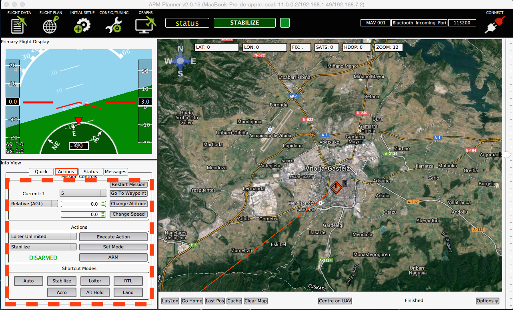
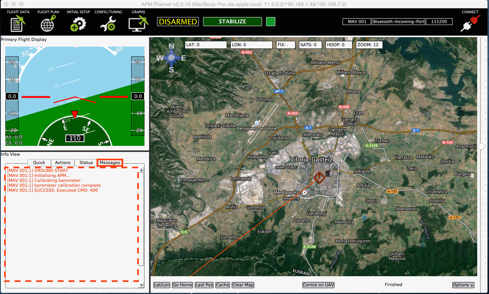

# Planificador APM

[APM Planner](http://planner2.ardupilot.com/) 2.0 es una aplicación de código abierto de la estación de control en tierra para MAVLink basada en los autopilotos incluyendo [Erle-Robotics](http://erlerobotics.com) productos que pueden ejecutarse en Windows, Mac OS X y Linux.

###Instalación

Puedes descargar el APM Planner en éstos links:

* [Linux](http://planner2.ardupilot.com/wiki/installation-for-linux/)
* [Windows](http://planner2.ardupilot.com/wiki/install-windows/)
* [Mac](http://planner2.ardupilot.com/wiki/mac-install/)

###Conectando a Erle-Brain/Vehículos

Una vez que hayas instalado el APM Planner en tu ordenador, el siguiente paso es establecer una conexión entre tu ordenador y [Erle-Brain](http://erlerobotics.com/blog/erle-brain).

Cuando enciendas [Erle-Brain](http://erlerobotics.com/blog/erle-brain) o un vehículo/drone que contiene éste producto, automáticamente genera un punto de conexión WiFi y genera un puerto de telemetría (11.0.0.2:6000) para intercambiar datos con el GCS.

Sigue los siguientes pasos para conectar:

* Conéctate a WiFi, normalmente llamado **erle-copter** o **erle-brain**. La contraseña es **holaerle**.
* Abre APM Planner
* Abre la pestaña **Communication**, y haz click en **Add Link -> UDP**
* Haz click en **Add IP** y establécela a **11.0.0.2:6000**, como en la siguiente imágen:

* Click en **Connect**
* Reinicia APM

Ahora la conexión debería establecerse automáticamente. Si no lo tienes claro, puede ver [éste video](https://www.youtube.com/watch?feature=player_detailpage&v=pKJyeTF_Qbo#t=69)!

###Básicos de APM Planner

#####Pantalla de datos de vuelo

Gracias a **la pantalla de vuelo principal**, el usuario puede ver la orientación y la inclinación del drone.

**Ver info** el subpanel contiene variedad de información útil. En la primera pestaña, puedes ver los parámetros básicos de vuelo: altitud, pitch, toll y el ángulo de yaw, ...

En la pestaña **Action**, puedes armar el drone, seleccionar el modo de vuelo, enviar el drone a puntos establecidos,...

En la subpestaña **Messages** puedes ver los mensajes enviados usando MAVLink. Este mensaje es útil para saber en que estado está el autopiloto.

######Configuración Inicial

Esta pestaña se usa para calibrar el 