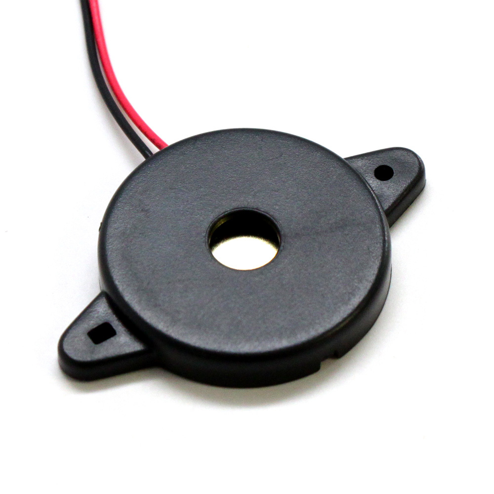

 # Buzzer
 
El zumbador es un dispositivo útil para conocer diferentes estados del drone. Se pueden distinguir los distintos estados: Armado, desarmado... Se puede utilizar también para generar sonidos personalizados.

