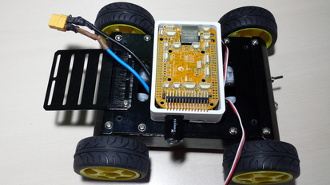
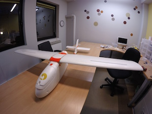

# Vehículos

Erle-Brain puede integrar diferentes tipos de vehículos gracias a su modularidad. El PXF ha sido diseñado para soportar el proyecto APM (ardupilot), puede ser utilizado por diferentes tipos de vehículos:

Estos son los vehículos que ofrecemos:

- Erle-Rover:

- Erle-Copter:

- Erle-Plane:

Estos vehículos están disponibles en [Tienda Erle Robotics](http://erlerobotics.com/blog/product-category/vehicles/)

Estas soluciones específicas no son las únicas, en un futuro, estamos seguros de que se lanzarán nuevos vehículos.