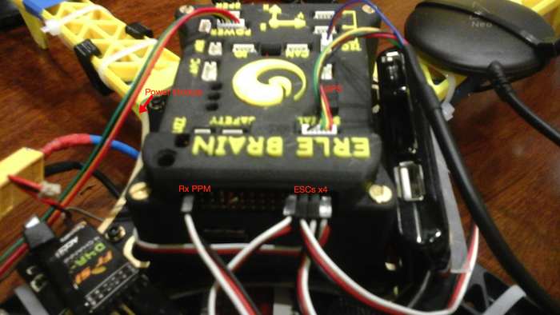

#Conexiones Erle-Copter

Para poder volar el drone correctamente, las conexiones entre Erle-Brain y los ESC, el receptor RC y el GPS necesitan estar bien hechas.

Esta imágen explica cómo hacerlo:

