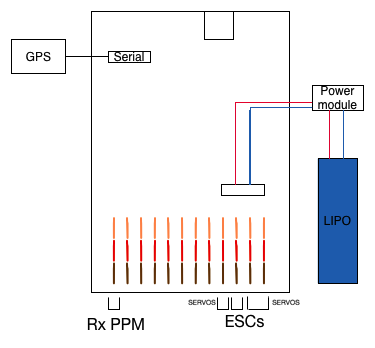

#Conexiones Erle-Plane

Para poder volar el plane correctamente, las conexiones entre Erle-Brain y los ESC del plane, el servo, el receptor RC y el GPS necesitan configurarse apropiadamente.

Esta imagen explica cómo hacerlo:

